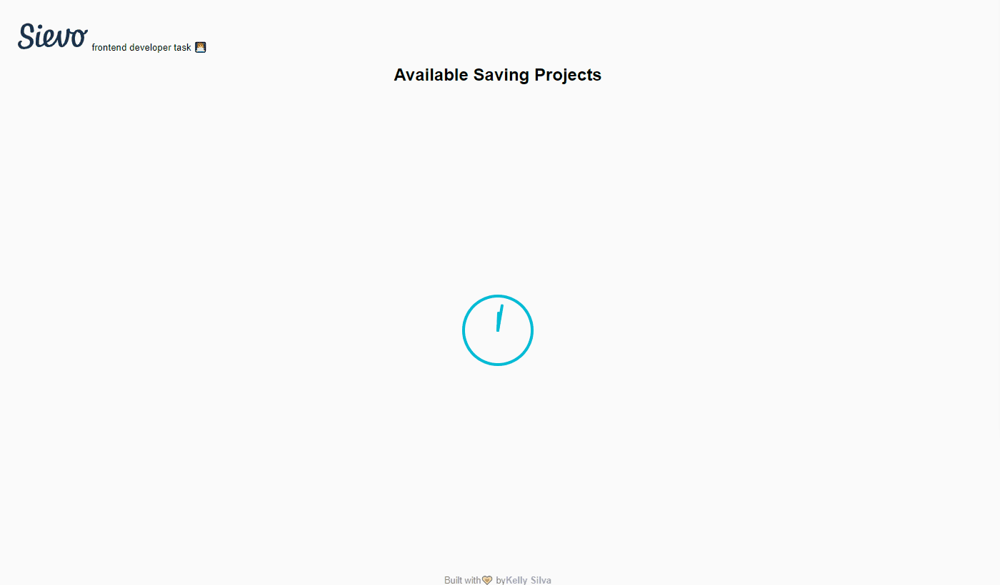

# Sievo frontend developer task

This is a task for frontend developer position at Sievo

See the online [Preview](http://sievo.kellyregina.com.br/) here.

And a gif 

# Sumary

- [Features](#features)
- [Technologies](#Technologies)
- [Scalable Folder Structure](#scalable-folder-structure)
- [Requirements](#Requirements)
- [Installing and Running](#installing-and-running)
- [Tests](#tests)
- [Author](#author)

### Features:

- **General**
  - List of projects.
  - Sort by date.
  - Filter by description

### Technologies

#### Frontend

- [React](https://reactjs.org/)
  - [React Hooks](https://reactjs.org/docs/hooks-intro.html)
  - [Suspense (Experimental)](https://reactjs.org/docs/concurrent-mode-suspense.html)
  - [Use Fetch](https://github.com/ava/use-http)
  - [Use Debounce](https://github.com/xnimorz/use-debounce)
- [Jest](https://jestjs.io/)
  - [Fetch mock](http://www.wheresrhys.co.uk/fetch-mock/#usageinstallation)
  - [Render Hook](https://github.com/testing-library/react-hooks-testing-library)
- [Styled Components](https://styled-components.com/)
- [CSS Varibles](https://www.w3schools.com/css/css3_variables.asp)

### Scalable Folder Structure

```
    Sievo
    └── src
        ├── App
        │   └── index.js
        │   └── test.js
        │   └── styles.js
        ├── Feature
        │   └── index.js
        │   └── test.js
        │   └── styles.js
        │   └── FeatureSpecificComponent
        │      └── index.js
        │      └── test.js
        │      └── styles.js
        ├── components
        │   └── index.js
        │   └── test.js
        │   └── styles.js
```

### Requirements

To run this project you will of
[NodeJs](https://nodejs.org/en/download/)

### Installing and Running

Download and unzip the project:

```
https://drive.google.com/drive/folders/1y_VV407hIGF0fDdyuPWwYgOPSPDOYEgS?usp=sharing
```

#### In the root folder run:

```
npm install
```

Start the app

```
npm start
```

### Tests

#### In the root folder run:

```
npm run tests
```

### Author

- **Kelly Silva** - [Linkedin](https://www.linkedin.com/in/kregina/), [Github](https://github.com/kregina/) 😺
